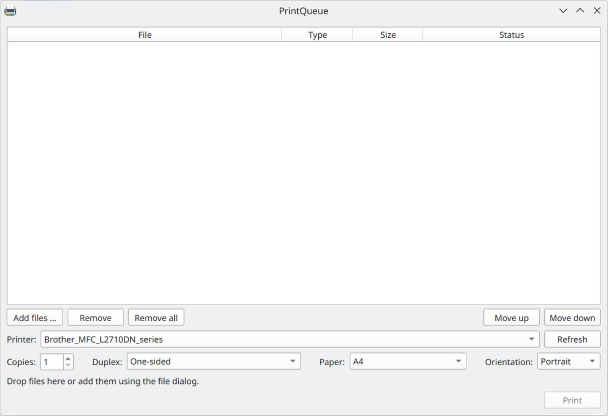

# PrintQueue for Linux

PrintQueue is a Linux desktop application for collecting and arranging multiple documents
and sending them to CUPS as a single print job. It supports KDE Plasma and GNOME and is
designed as a Linux alternative to Print Conductor.

Files are not converted when they are added. Conversion starts only when the user clicks
**Print**, keeping the user interface responsive.



## Features

- Add files through drag and drop or a file dialog
- Add multiple files from the command line, Dolphin, or GNOME Files
- Reorder files and remove individual or all entries
- Select a printer, copy count, duplex mode, paper size, and orientation
- Detect printer capabilities dynamically through CUPS
- Convert office documents to PDF with LibreOffice in headless mode
- Convert images, including multi-page TIFF files, to PDF
- Merge all documents in list order and submit them as one print job
- Show progress and actionable error messages, with support for cancellation
- Forward files from additional launches to the running PrintQueue instance

## Supported formats

| Category | Formats |
|---|---|
| Documents | PDF |
| Microsoft Office | DOC, DOCX, XLS, XLSX, PPT, PPTX |
| OpenDocument | ODT, ODS, ODP |
| Images | PNG, JPG, JPEG, TIFF, BMP, WebP |

## Requirements

- A Linux distribution with KDE Plasma or GNOME
- Python 3.10 or newer for development or source installation
- The CUPS client commands `lp`, `lpstat`, and `lpoptions`
- LibreOffice only when printing Office or OpenDocument files

On Ubuntu/Kubuntu, install only the missing runtime components:

```bash
command -v lp >/dev/null || sudo apt install cups-client
command -v libreoffice >/dev/null || command -v soffice >/dev/null || sudo apt install libreoffice
```

This does not reinstall an existing LibreOffice installation. Installations outside APT
are also recognized when `libreoffice` or `soffice` is available through `PATH`.

## Install released Debian packages

Download the latest release from https://github.com/geri777/print-queue/releases/
Install the printqueue package with:

```bash
sudo apt install ./printqueue_0.1.0_amd64.deb
```

Install the integration package for your desktop (Right-click → **Add to PrintQueue** in the file manager). The integration packages are optional and can be installed or removed at any time. 

```bash
# KDE Plasma / Dolphin
sudo apt install ./printqueue-dolphin_0.1.0_all.deb

# GNOME / Files (Nautilus)
sudo apt install ./printqueue-nautilus_0.1.0_all.deb
```

The integration packages depend on the matching version of the main `printqueue` package.
They are intentionally separate, so installing PrintQueue on GNOME does not install
Dolphin and installing it on KDE does not install Nautilus integration.

LibreOffice is deliberately declared as `Suggests`, not as a hard dependency. PDFs and
images can be printed without it; PrintQueue reports the missing component only when an
office document needs to be converted.

Uninstall PrintQueue with:

```bash
sudo apt remove printqueue
```

## Install from source

Clone the repository and create an isolated Python environment:

```bash
git clone https://github.com/geri777/print-queue.git
cd print-queue
python3 -m venv .venv
.venv/bin/python -m pip install --upgrade pip
.venv/bin/python -m pip install -e .
.venv/bin/printqueue
```

## Usage

Launch PrintQueue without arguments or pass multiple files directly:

```bash
printqueue
printqueue proposal.docx appendix.pdf scan.png
```

Additional launches forward their files to the existing window. After a successful print
submission, PrintQueue asks whether the files should be removed from the list.

### Temporary files

Converted files exist only during print preparation in a protected subdirectory of the
system temporary directory, normally `/tmp/printqueue-*` on Linux. They are removed after
submission to CUPS and also after errors or cancellation.

## Manual File-manager context-menu integration

### Dolphin

For an installation from source, install the application entry and Dolphin service menu
for the current user:

```bash
install -Dm644 resources/org.printqueue.PrintQueue.desktop \
  ~/.local/share/applications/org.printqueue.PrintQueue.desktop
install -Dm755 resources/dolphin/printqueue-servicemenu.desktop \
  ~/.local/share/kio/servicemenus/printqueue-servicemenu.desktop
```

Supported files then provide an **Add to PrintQueue** action in Dolphin's context menu.
Restart Dolphin if it was already running. The Debian package installs this integration
system-wide through the separate `printqueue-dolphin` package.

### GNOME Files (Nautilus)

Install the Nautilus extension for the current user:

```bash
install -Dm644 resources/nautilus/printqueue.py \
  ~/.local/share/nautilus-python/extensions/printqueue.py
nautilus -q
```

The **Add to PrintQueue** action appears for supported local files after GNOME Files is
started again. The `printqueue-nautilus` package installs the extension system-wide and
declares `nautilus` and `python3-nautilus` as its dependencies.

## Development

Install the development dependencies:

```bash
python3 -m venv .venv
.venv/bin/python -m pip install --upgrade pip
.venv/bin/python -m pip install -e '.[dev]'
```

Run the tests and static checks:

```bash
.venv/bin/pytest -q
.venv/bin/ruff check .
.venv/bin/ruff format --check .
```

Project layout:

```text
src/printqueue/          Application and user interface
src/printqueue/services Conversion and printing services
tests/                   Automated tests
resources/               Desktop and Dolphin integration
resources/nautilus/      GNOME Files integration
packaging/               Binary and Debian packaging scripts
```

## Build a standalone Linux binary

The supplied script uses Nuitka with its official PySide6 integration. Install the build
prerequisites on Ubuntu/Kubuntu, create a fresh virtual environment, and run the build:

```bash
sudo apt install python3-venv build-essential dpkg-dev libxkbcommon0
python3 -m venv .venv
.venv/bin/python -m pip install --upgrade pip
.venv/bin/python -m pip install -e '.[dev]'
packaging/build-binary.sh
```

The script installs its Python-side build tools, including `patchelf`, inside the virtual
environment and adds that environment to `PATH` for the build. If this is not possible on
the target system, install the native command with `sudo apt install patchelf`.

The result is written to `dist/printqueue.bin`. The script exposes the complete Nuitka
output and stops on compilation errors. The binary includes Python, PySide6/Qt, and the
required Python libraries. CUPS and LibreOffice remain system components.

Do not move a virtual environment after creating it because its launcher scripts contain
absolute paths. If the repository has moved, create a new virtual environment at the new
location. A custom environment can be passed explicitly:

```bash
packaging/build-binary.sh /path/to/venv/bin/python
```

## Build a Debian package

Create the main package and both optional integration packages from the standalone binary:

```bash
packaging/build-deb.sh dist/printqueue.bin 0.1.0
```

The results are written to `dist`:

```text
dist/printqueue_0.1.0_amd64.deb
dist/printqueue-dolphin_0.1.0_all.deb
dist/printqueue-nautilus_0.1.0_all.deb
```

Inspect and install the package:

```bash
dpkg-deb --info dist/printqueue_0.1.0_amd64.deb
dpkg-deb --contents dist/printqueue_0.1.0_amd64.deb
sudo apt install ./dist/printqueue_0.1.0_amd64.deb
```

Install one of the optional desktop integrations afterward as shown above.

## Publishing a `.deb` release

PrintQueue can be distributed as a `.deb`. Before publishing a GitHub release:

1. Update the version in `pyproject.toml` and `src/printqueue/__init__.py`.
2. Run the complete test and Ruff suites.
3. Build on the oldest Ubuntu/Kubuntu version you intend to support. A binary built there
   will generally run on newer glibc versions; the reverse is not reliable.
4. Build the `.deb` with the same version number.
5. Test installation, launch, LibreOffice conversion, CUPS printing, and removal in a
   clean virtual machine.
6. Generate a checksum:

   ```bash
   sha256sum dist/printqueue_0.1.0_amd64.deb \
     > dist/printqueue_0.1.0_amd64.deb.sha256
   ```

7. Create a Git tag such as `v0.1.0` and attach the main `.deb`, both integration packages,
   and their `.sha256` files to the GitHub release.

Build and test separate packages in reproducible CI environments for each supported CPU
architecture or substantially different distribution baseline.

## License

This project is published under **GPL-3.0-or-later**

## Disclaimer

This software is provided "as is" without warranty of any kind. The author is not liable for any damages or losses resulting from the use of this software. Use at your own risk.

Print Conductor is a registered trademark of fCoder Group, Inc. This project is not affiliated with or endorsed by fCoder Group, Inc. 
